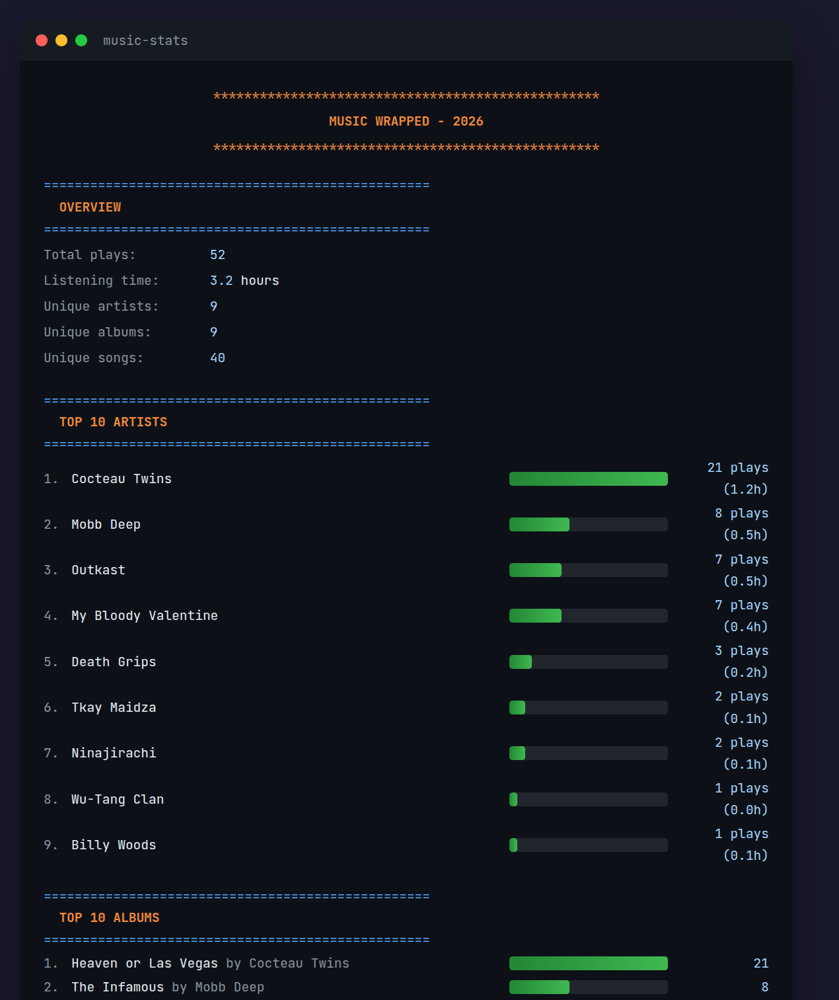

# Music Analytics

Personal listening analytics for Linux. Tracks play history from MPRIS-compatible players and generates Spotify Wrapped-style statistics.

## Screenshots

<p align="center">
  
</p>

## Features

**Tracking**
- Automatic play logging via MPRIS D-Bus
- Smart scrobbling (30s minimum, 50% or 4min threshold)
- Local-only mode (filters streaming services)
- Seek, volume, and context tracking

**Analytics**
- Top artists, albums, and songs
- Listening sessions and streaks
- Skip rate and completion metrics
- Genre and decade breakdowns
- Listener personality analysis

**Audio Analysis** *(optional)*
- Tempo, energy, danceability
- Key, mode, valence
- Requires `librosa`

## Installation

**Prerequisites:** Python 3.8+, systemd, MPRIS-compatible player

```bash
git clone https://github.com/tom-bleher/music-analytics.git ~/.local/share/music-analytics
cd ~/.local/share/music-analytics

python3 -m venv venv
venv/bin/pip install dbus-next mutagen pulsectl
venv/bin/pip install librosa  # optional, for audio analysis

cp music-tracker.service ~/.config/systemd/user/
systemctl --user daemon-reload
systemctl --user enable --now music-tracker

mkdir -p ~/.local/bin
ln -s ~/.local/share/music-analytics/music_stats.py ~/.local/bin/music-stats
```

## Usage

```bash
music-stats                  # Current year
music-stats --week           # Last 7 days
music-stats --all-time       # All time
music-stats --deep           # Advanced analytics
music-stats --sessions       # Listening sessions
music-stats --full           # Everything

music-stats --scan ~/Music   # Scan library metadata
music-stats --analyze ~/Music # Analyze audio features
```

## Configuration

Edit `music_tracker.py`:

```python
TRACK_LOCAL_ONLY = True      # Ignore streaming services
MIN_PLAY_SECONDS = 30        # Minimum play time
MIN_PLAY_PERCENT = 0.5       # Or 50% of track
```

Recognized local players: Amberol, Lollypop, GNOME Music, Rhythmbox, Audacious, DeaDBeeF, Clementine, Strawberry, Elisa, Quod Libet

## Service Management

```bash
systemctl --user status music-tracker
systemctl --user restart music-tracker
journalctl --user -u music-tracker -f
```

## License

MIT
